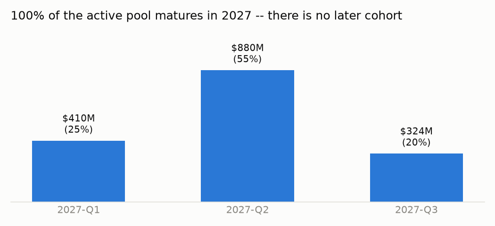
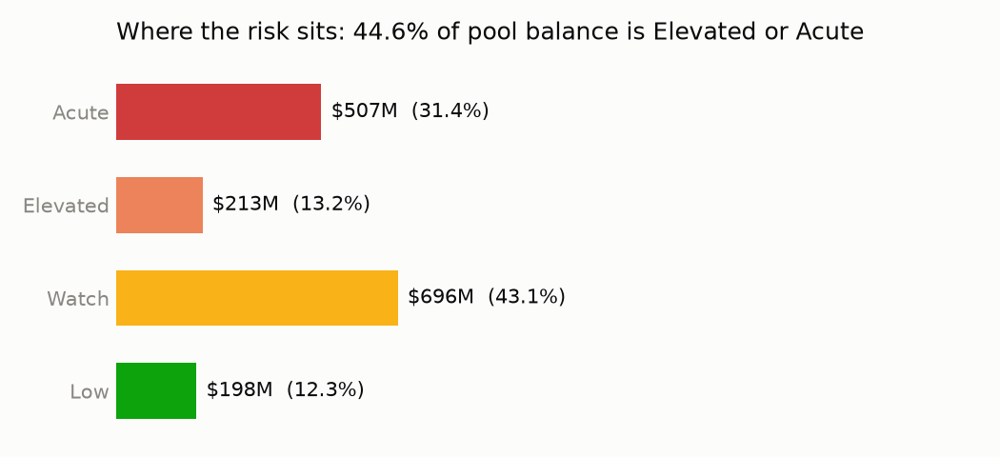
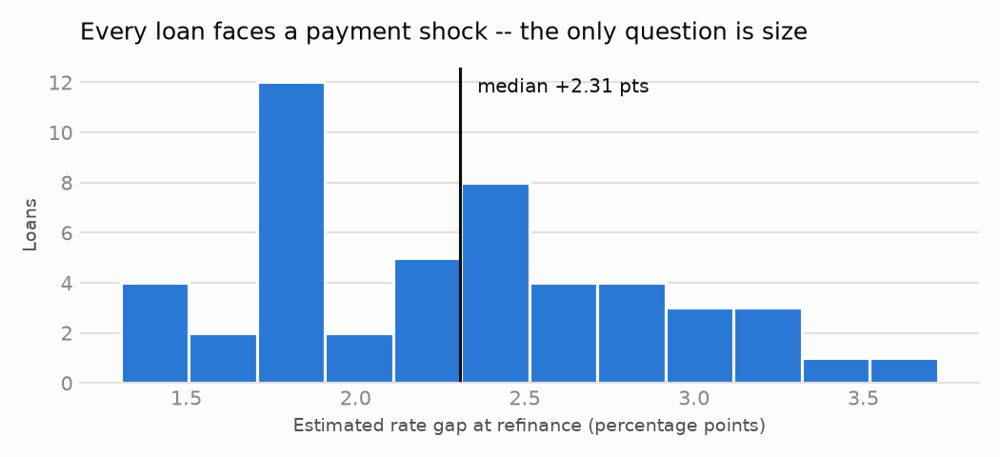
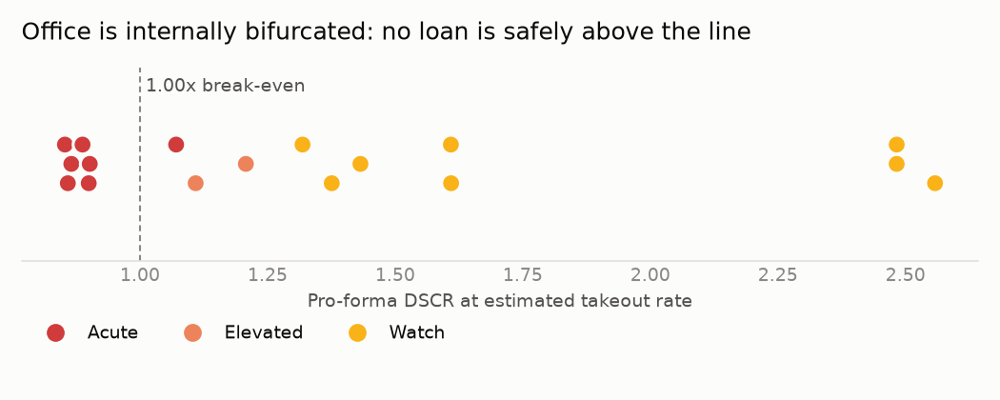
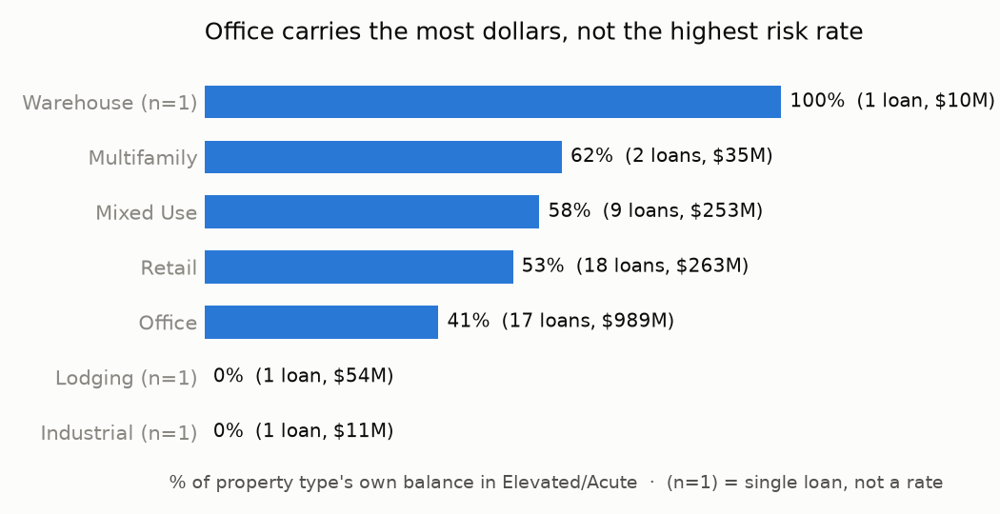

# CRE Credit Risk: Loan-Level Distress Analysis of the 2026 Maturity Wall

*GS Mortgage Securities Trust 2017-GS6 and 2017-GS7 — 49 active real-estate loans,
$1,614.7M, as of the June 2026 servicer reporting period.*

## 1. Recommendation

**Refer three loans to special servicing now, not at maturity.** 90 Fifth Avenue and
One West 34th Street (both Mixed Use, New York, GS7) and Sienna Bay (Multifamily,
Florida) are cash-flow distressed *today* — DSCR of 0.14x, 0.63x, and 1.11x — with no
dependence on where rates land at refinance. Waiting for the 2027 maturity date to act
only narrows the workout options. Beyond that, **do not treat Office as the exposure to
cut.** At 61.3% of pool balance it's the largest dollar exposure to the wall, but only
40.6% of its own balance sits in Elevated/Acute risk — a *lower* rate than Retail
(53.5%), Mixed Use (58.1%), or Multifamily (62.0%). The better move is loan-level
triage across the 18 Acute and 8 Elevated loans ($720.3M, 44.6% of the pool), starting
outreach 12-18 months ahead of the pool's heavily front-loaded 2027 maturities (55% of
balance matures in Q2 2027 alone) rather than waiting for a reactive, single-quarter
surge in workout volume.

## 2. The pool

Two 2017-vintage conduit CMBS deals from the same Goldman Sachs issuance shelf, chosen
because their 10-year terms mature squarely in the 2026-2027 wall. After excluding
defeased loans (Treasury-backed, zero refinance risk) and paid-off loans, **49 active
real-estate loans total $1,614.7M**, concentrated in Office (61.3% of balance), Retail
(16.3%), and Mixed Use (15.7%), with small Multifamily, Lodging, Industrial, and
Warehouse tails. Every single one of these 49 loans matures in **2027** — there is no
later-maturity cohort in this data that has runway to wait out today's rate
environment. This pool doesn't diversify away the timing risk; it simply *is* the wall.

## 3. Where the risk sits

Every loan was scored on a pro-forma refinance DSCR — today's reported DSCR rescaled
by the ratio of its current coupon to an estimated takeout rate (10-year Treasury plus
a property-type spread) — then escalated for high leverage or Office/Lodging exposure.
**44.6% of pool balance ($720.3M) sits in the Elevated or Acute tier:**

| Tier | Loans | Balance | % of pool |
|---|---|---|---|
| Acute | 18 | $507.1M | 31.4% |
| Elevated | 8 | $213.2M | 13.2% |
| Watch | 14 | $695.9M | 43.1% |
| Low | 9 | $198.5M | 12.3% |

This isn't a uniform result mechanically inflated by the wall itself — every loan in
the pool feels *some* rate-driven payment shock (median gap +2.31 points, in line with
the 200-300bps refinancing environment CMBS commentary describes for this vintage), but
only 44.6% of balance actually fails to cover debt service at the new rate. The
segmentation separates loans that can absorb the shock from loans that cannot.

## 4. What drives it

**Property type is the primary driver, but not in the direction the market narrative
predicts.** Office is the dominant *dollar* exposure but is proportionally the
*healthiest* of the pool's major property types — Multifamily, Mixed Use, and Retail
all run a higher share of their own balance in Elevated/Acute. That said, Office is
still internally split: pro-forma DSCR within the 17 office loans spans 0.85x to
2.56x, and **no office loan clears into the Low tier** — the whole distribution has
shifted toward risk, just not as far as it has for the smaller property types.

**Geography and loan size are secondary.** California is the largest single-state
concentration (28.3% of balance) but skews healthier than the pool average — a handful
of large, low-leverage trophy assets. New York and DC concentrations run close to the
pool's overall Elevated/Acute rate. Loan size shows no consistent pattern; risk tracks
cash-flow cushion and property type, not deal size. Vintage is uninformative here —
47 of 49 active loans originated in 2017, so there's no earlier/later cohort to
compare against.

**Three loans are distressed independent of the rate environment.** 90 Fifth Avenue
(DSCR 0.14x), One West 34th Street (0.63x), and Sienna Bay (1.11x today, versus a pool
median of 1.60x) would be troubled at any refinance rate — these are operating
problems the maturity wall will surface, not create.

## 5. What to do

1. **Immediate workout referral** for the three loans above ($78.6M combined) — their
   distress predates the rate environment and won't resolve by waiting for 2027.
2. **Proactive borrower outreach on the 18 Acute loans ($507.1M)**, starting now rather
   than at the maturity date. Options to negotiate ahead of default: partial paydowns
   to bring proceeds in line at the new rate, extension with a cash-flow sweep, or
   mezzanine/preferred equity to bridge a proceeds shortfall.
3. **Don't lead with a blanket Office reduction.** The data argue against treating
   Office as the property type to de-risk first; Retail and Mixed Use, despite being
   smaller dollar exposures, run hotter proportionally and deserve equal attention per
   dollar at risk.
4. **Build workout capacity for a Q2 2027 surge**, not steady-state case flow — 55% of
   pool balance matures in a single quarter, and a reactive posture risks being
   overwhelmed exactly when leverage to negotiate is lowest.
5. **Refresh appraisals on the Acute/Elevated loans before finalizing workout terms**
   (see limits below) — current LTV is likely understated pool-wide, which affects how
   much proceeds shortfall to actually expect.

## 6. Method and limits

**Data:** SEC EDGAR ABS-EE `EX-102` loan-level exhibits (Regulation AB II), June 2026
servicer reporting period, for GS Mortgage Securities Trust 2017-GS6 and 2017-GS7.
Parsed values were cross-checked against each deal's original 2017 term sheet (an
independent filing) and matched to within 0.04%.

**Segmentation:** pro-forma DSCR = reported DSCR × (current coupon ÷ estimated takeout
rate), escalated one tier for LTV > 80% or Office/Lodging property type. Full rule and
rationale in `src/segment.sql`.

**What we couldn't see, stated plainly:**
- **Property valuations are stale.** Every valuation in this data is from origination
  (2016-2017) — there is no current appraisal. Reported LTV almost certainly
  understates true current leverage, especially for Office, where values have likely
  fallen since 2017. The proceeds-shortfall risk in this memo is more likely
  understated than overstated.
- **Refinance spreads are an analyst assumption, not a live market quote.** CMBS
  conduit spread data (Trepp, CMA) sits behind paid subscriptions not accessed for
  this project. The spreads used are directional estimates, checked against the
  broader market's widely-cited 200-300bps refinancing environment for this vintage
  (our pool median landed at +231bps) — a sanity check, not a guarantee of precision.
- **19 of 49 loans (39%) report DSCR from at-securitization underwriting, not actual
  current performance** — servicers hadn't populated "most recent" financials for
  these loans as of this filing. Their DSCR reflects 2017 underwriting, not 2026
  operations.
- **No sponsor quality or ownership-level information.** A well-capitalized sponsor
  can push a Watch-tier loan through refinancing that a thin one cannot; this data has
  no visibility into that.
- **Debt-service estimate is interest-only-equivalent**, not a true amortization
  schedule — a simplification, not a loan-by-loan cash-flow model.
